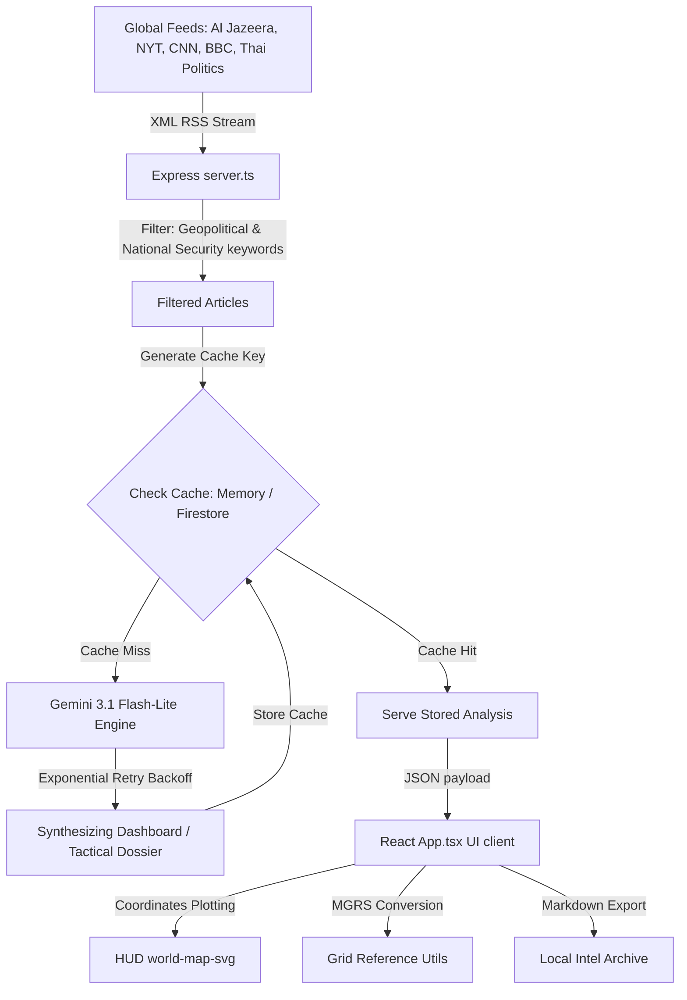

# DEFCON OSINT METIS 🌐✈️
### *Advanced Neural Geopolitical Intelligence & OSINT Threat Analysis Dashboard*

[](https://opensource.org/licenses/MIT)
[](https://react.dev/)
[](https://www.typescriptlang.org/)
[](https://vite.dev/)
[](https://tailwindcss.com/)
[](https://ai.google.dev/)

**DEFCON OSINT METIS** is a modern, high-fidelity Open Source Intelligence (OSINT) and threat modeling dashboard. It acts as a localized real-time command center, ingest-filtering global political and national security news feeds, and utilizing the Google Gemini API to analyze geopolitical threat vectors, extract actors/hotspots, map coordinates, and evaluate cognitive warfare narrative framing.

---

## ⚡ Key Features

*   **Unified Multi-Agency RSS Ingestion**: Ingests, normalizes, and filters feeds from top global and local outlets: *Al Jazeera, CNN, BBC, New York Times, Prachachat, Matichon, and Thairath*.
*   **Geopolitical Threat Matrix**: Automatically maps and highlights critical regional hot-zones on an interactive HUD world map utilizing high-fidelity SVG coordinates.
*   **MGRS Coordinate Converter**: Programmatically translates latitudes and longitudes into standard **Military Grid Reference System (MGRS)** coordinate structures.
*   **Cognitive Warfare & Propaganda Assessment**: Performs deep neural assessments on article bias level, narrative focus, loaded phrases, and crucial background omissions.
*   **Strategic Vulnerability Modeling**: Computes threat levels (1-10) and outlines immediate target threats alongside long-term structural risks to regional stability.
*   **Dual-Language Mode**: Real-time localization toggle supporting complete English (`EN`) and Thai (`TH`) translations.
*   **Exportable Intel Briefings**: Single-click downloads to export compiled tactical intelligence dossiers as standardized Markdown (`.md`) reports.
*   **Layered Resilient Fallback Architecture**: Uses a multi-tiered fallback layout. If the Gemini API or database connection limit is hit, the application gracefully serving dynamic resilient simulations to maintain continuous operation.

---

## 🛠️ Technology Stack

### Frontend (Client-side)
*   **React 19** & **TypeScript** — Component architecture and type-safe workflows.
*   **Vite 6** — Extremely fast build tool and dev server.
*   **Tailwind CSS v4** — High-performance utility styles and customizable `@theme` system configuration.
*   **Framer Motion** — Fluid, physics-based micro-interactions and transitions.
*   **Lucide React** — Standardized vector telemetry icons.
*   **world-map-svg** — Responsive vector map component for plotting geolocations.

### Backend (Server-side)
*   **Express.js (Node.js)** — Dynamic API router.
*   **rss-parser** — Streamlined XML parse parser for RSS feeds.
*   **@google/genai SDK** — Official Google Developer API connector.
*   **Firebase SDK** — Cache validation database adapter.

---

## 🗺️ System Architecture



---

## 🚀 Setup & Installation

### Prerequisites
*   Node.js (v18.0 or newer)
*   NPM (v9.0 or newer)

### 1. Clone the repository
```bash
git clone https://github.com/YOUR_USERNAME/defcon-osint-metis.git
cd defcon-osint-metis
```

### 2. Install dependencies
```bash
npm install
```

### 3. Configure environment variables
Create a `.env` file in the root directory (based on `.env.example`):
```env
PORT=3000
GEMINI_API_KEY="YOUR_GOOGLE_GEMINI_API_KEY"
APP_URL="http://localhost:3000"
```

> [!TIP]
> You can acquire a free or pay-as-you-go Gemini API key from [Google AI Studio](https://aistudio.google.com/).

### 4. Running the application
Start the development server:
```bash
npm run dev
```
Open [http://localhost:3000](http://localhost:3000) in your web browser.

---

## 📦 Building and Deployment

To bundle both the React SPA and the Express backend server for production:

```bash
npm run build
```

This runs the Vite bundling tool for the frontend client, and compiling the Express backend server with `esbuild` into a single standalone build file inside `dist/`.

To start the production server:
```bash
npm run start
```

---

## 🔒 Security Classification & Policy

> [!NOTE]
> All information compiled inside this application is sourced strictly from public RSS news feeds. The intelligence reports generated are simulations produced by neural language models and should be cross-referenced with official, verified command signals.

---

## 📄 License
This project is licensed under the MIT License - see the [LICENSE](LICENSE) file for details.
